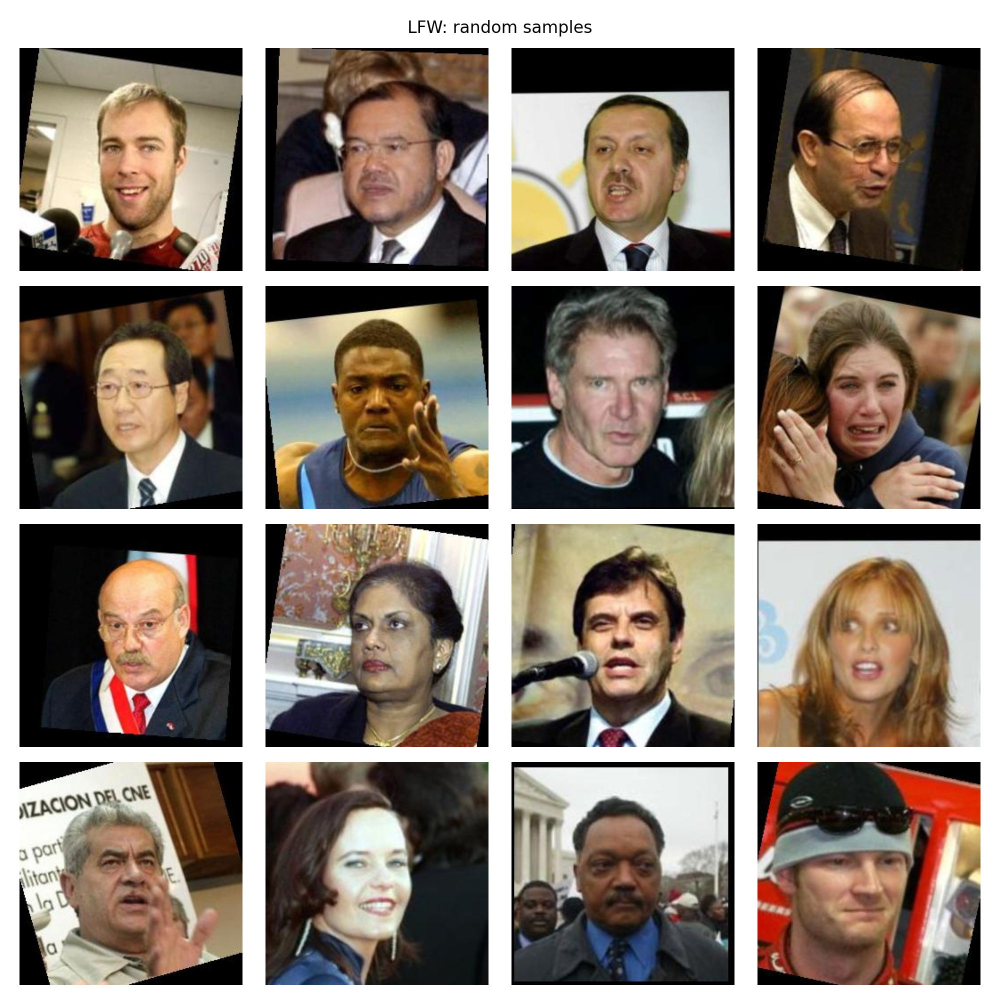
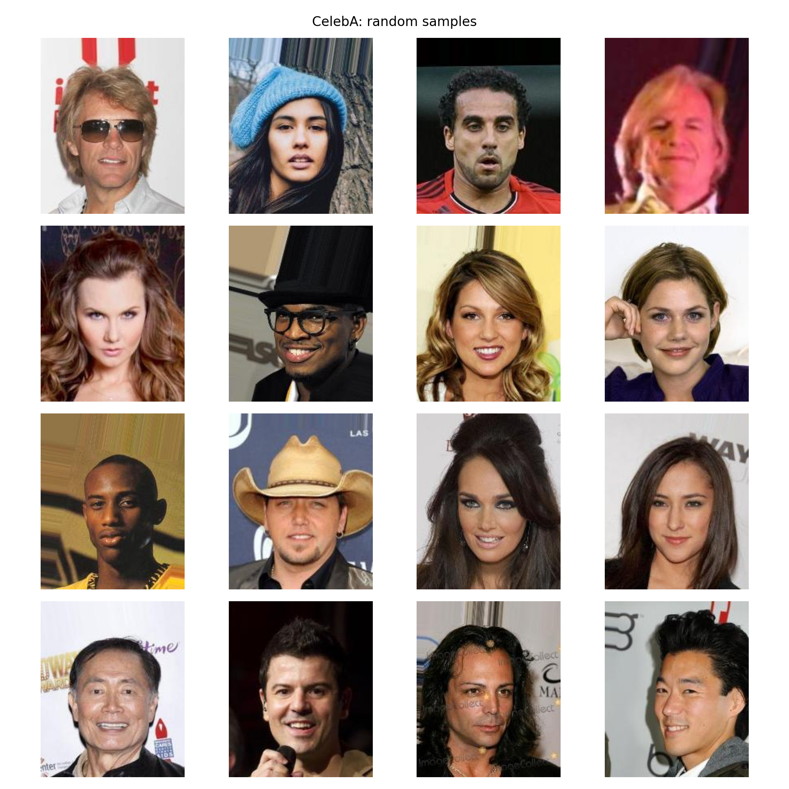
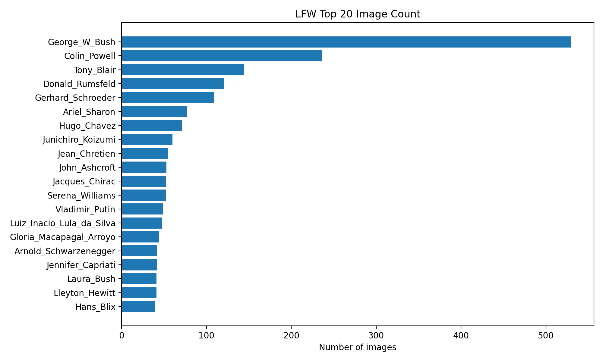
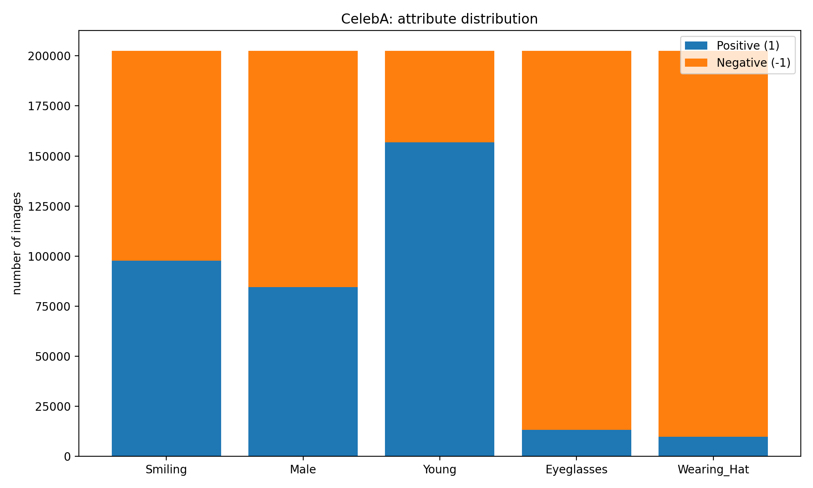

# Week 2 进度报告：探索CelebA和LFW数据集

## 1. 主要完成内容

1. 下载并整理**CelebA**和**LFW**数据集
2. 写相关代码读取数据集并统计信息，如图片数量和人物数量
3. 从两个数据集中随机抽取16个样本，检查图像内容和质量
4. 对LFW数据集进行人物分布统计，展示了图片数量最多的前20个人
5. 对CelebA数据集的其中五个属性进行统计分析并可视化

## 2. 数据集基础信息
通过运行 'docs/dataset_test.py' 得到了基础信息：

**LFW**的图片总数为13233，人物总数为5749
**CelebA**的图片总数为202599

## 3. 抽取随机样本
从LFW抽取的16个随机样本 
从CelebA抽取的16个随机样本 

## 4. LFW人物分布分析

从图里可以看出LFW数据集的人物样本分布不是很均匀，第一名的图片数量明显远高于其他人，超过500张，从第六名开始的样本数量都大约在40-100张之间，后面的样本数量差别相对没那么大。

## 5. CelebA样本的属性正负分布分析

从图中可以看出不同属性的不平均程度，比如Young的正样本明显更多，说明数据集中年轻的人脸占大多数，而Eyeglasses和Wearing_Hat正样本则非常少，说明绝大多数人没有戴眼镜和帽子，Smiling和Male则相对比较均匀。

