# 字节跳动智能视觉AI：人脸识别与特效技术结项报告

## 项目成果总结

1. 首先在项目初期，我完成了基础开发环境的搭建，包括 Python、PyTorch、OpenCV 以及人脸相关的依赖库 MMDetection、MMHuman3D 等 ，同时学习了 Git 和 Docker 的基本使用方法。完成环境验证后，我编写并运行了基础 OpenCV 图像处理程序，比如图像读取、灰度化和显示等功能

2. 然后我学习了人脸检测、人脸关键点定位、人脸对齐、人脸验证与人脸识别等基本概念，并对 CelebA、LFW 等人脸数据集进行了观察与可视化分析。我还用MMDetection自带的人脸检测模型在几张图上进行了人脸检测，部分检测结果如下。我也初步建立了对人脸识别完整流程的理解：先进行人脸检测，再通过关键点实现对齐，随后提取人脸特征并进行身份验证或识别。
    

    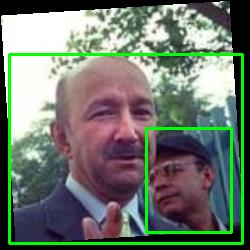
    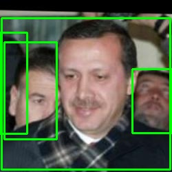
    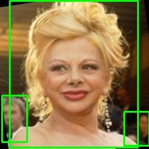
    

3.  在人脸检测部分，我主要学习了MTCNN、RetinaFace 等算法的基本原理，并MMDectection的框架在WIDER FACE数据集上训练了一个人脸检测模型，部分检测结果如下。可以看出训练的模型能够在图像上较稳定地检测出人脸区域。这阶段也让我更加清楚地理解了多尺度检测、召回率和精度等的概念。
    

    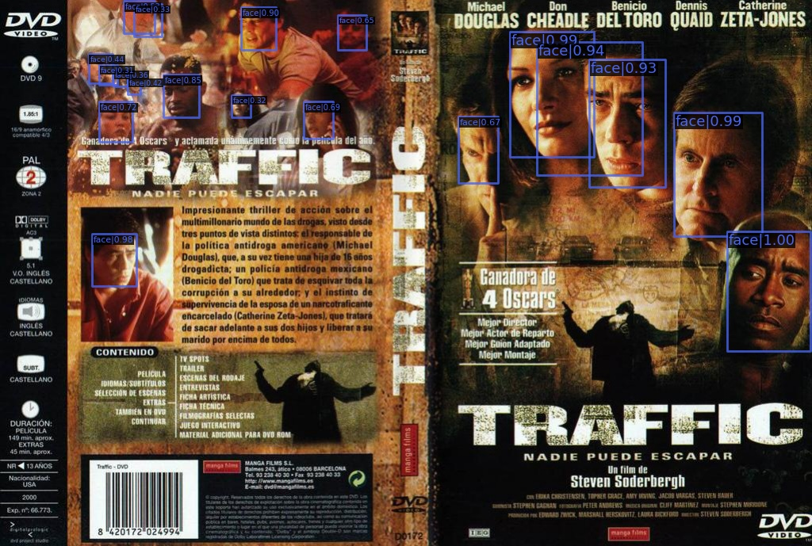
    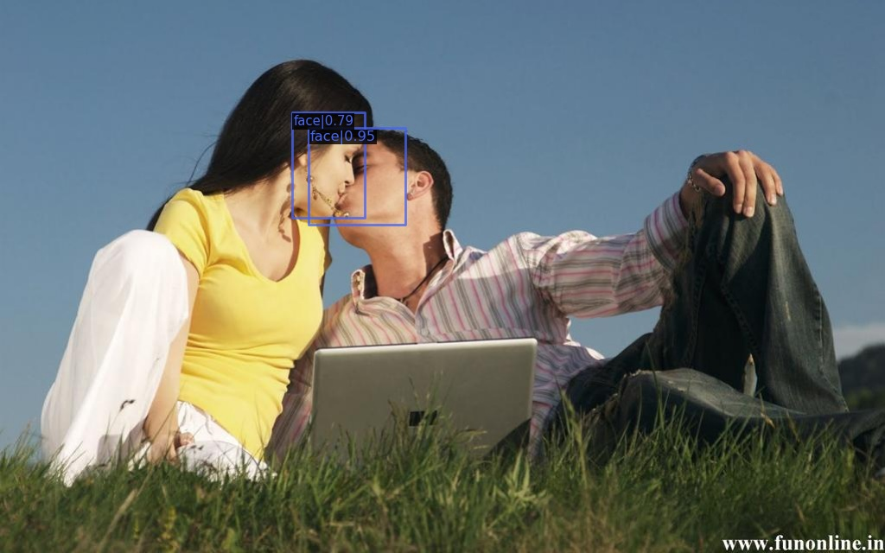
    

    

    
    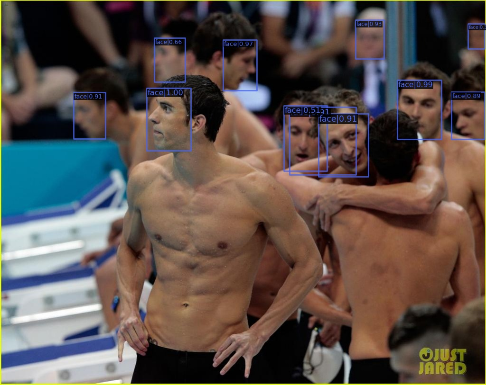
    

4. 在人脸关键点检测与对齐部分，我进一步学习了 HRNet 和 SAN 等关键点检测算法，并用MMPose里的HRNet配置文件在300W数据集上进行了训练与测试，部分关键点检测结果如下。同时，基于检测到的人脸关键点，我也实现了人脸对齐，通过仿射变换将人脸的几何位置进行统一，从而减少后续识别任务的干扰。
    
人脸关键点检测结果

    

    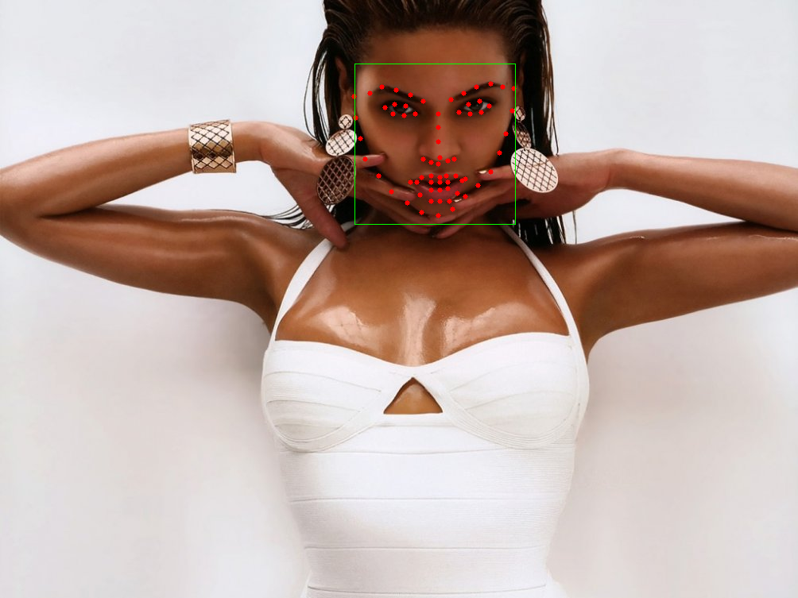
    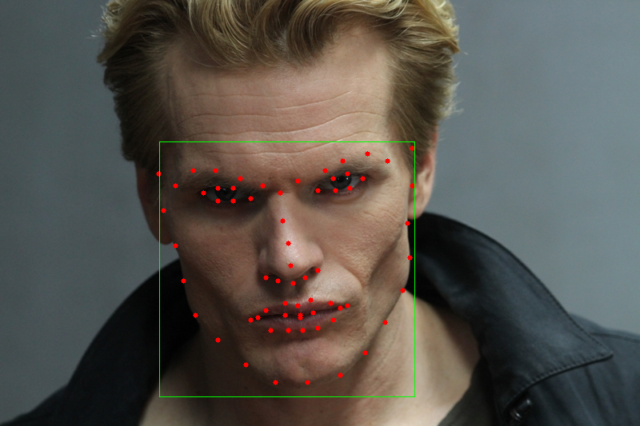
    

    

    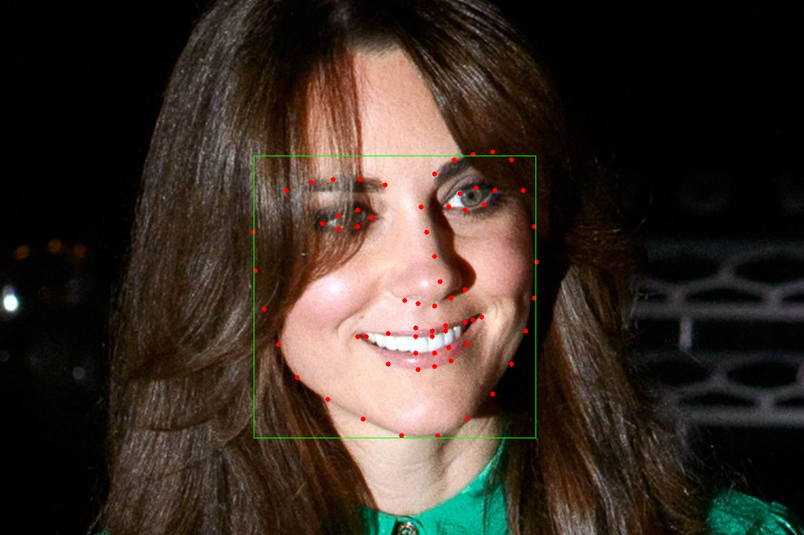
    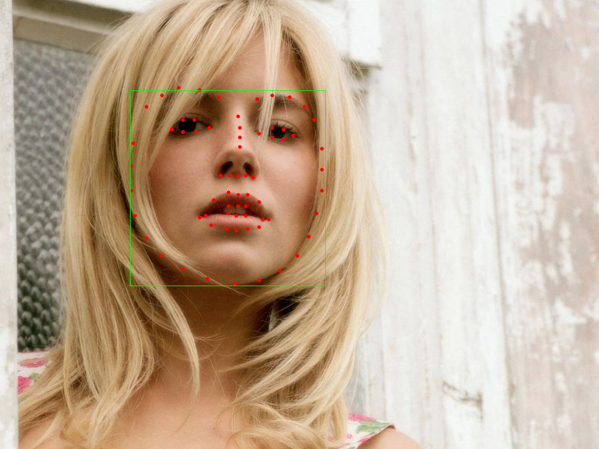
    

    
对应的人脸对齐结果

    

    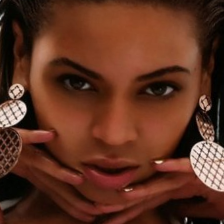
    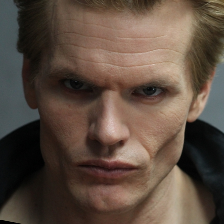
    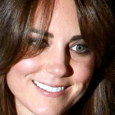
    
    

5. 在人脸识别模型训练部分，我学习了基于 ResNet 和 ArcFace loss 的人脸识别方法。然后用InsightFace 里的 ResNet-50 配置文件在 MS-Celeb-1M 的子集上完成了训练实验，训练过程中的损失曲线和准确率曲线如下。我从 MS-Celeb-1M 里用抽取不放回的方式随机抽取了五十万张照片作为子集，然后考虑到有些 identity 只有 1–2 张图像的极端情况会影响模型的泛化，我直接去除了这部分 identity 提高了数据的合理性。训练完成后我在 LFW 数据集上进行了人脸验证，准确率高达99.47%。通过这些任务我对 数据集合理性、embedding、特征归一化、余弦相似度以及人脸验证的基本机制有了更加深入的理解。
    

    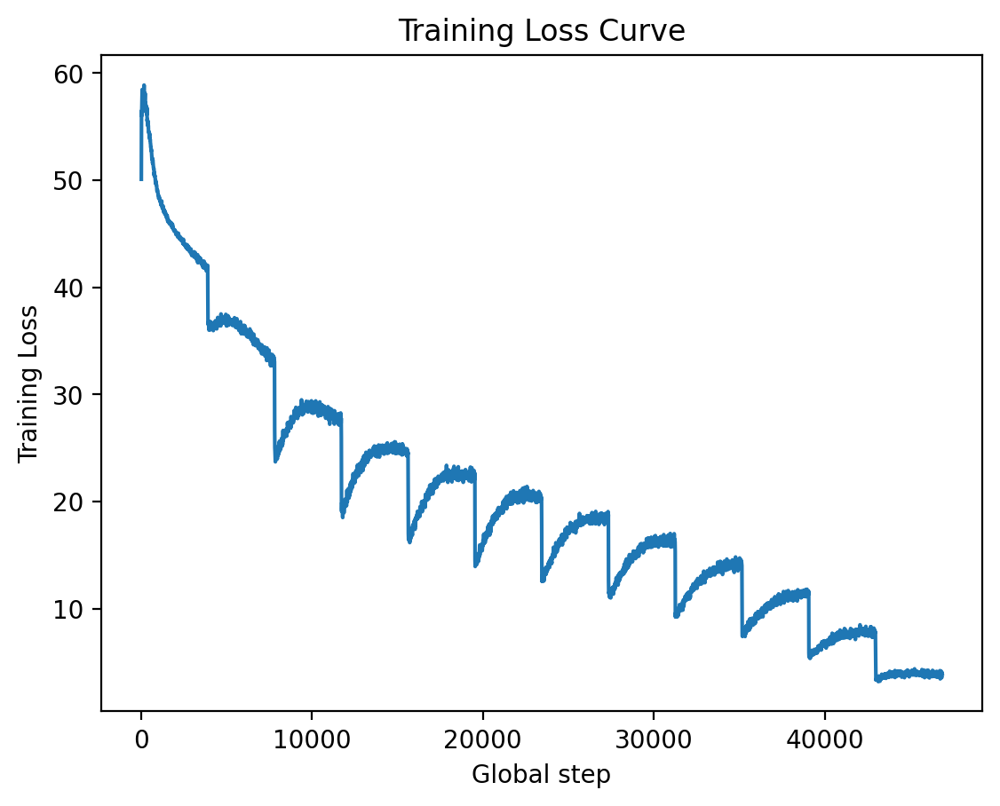
    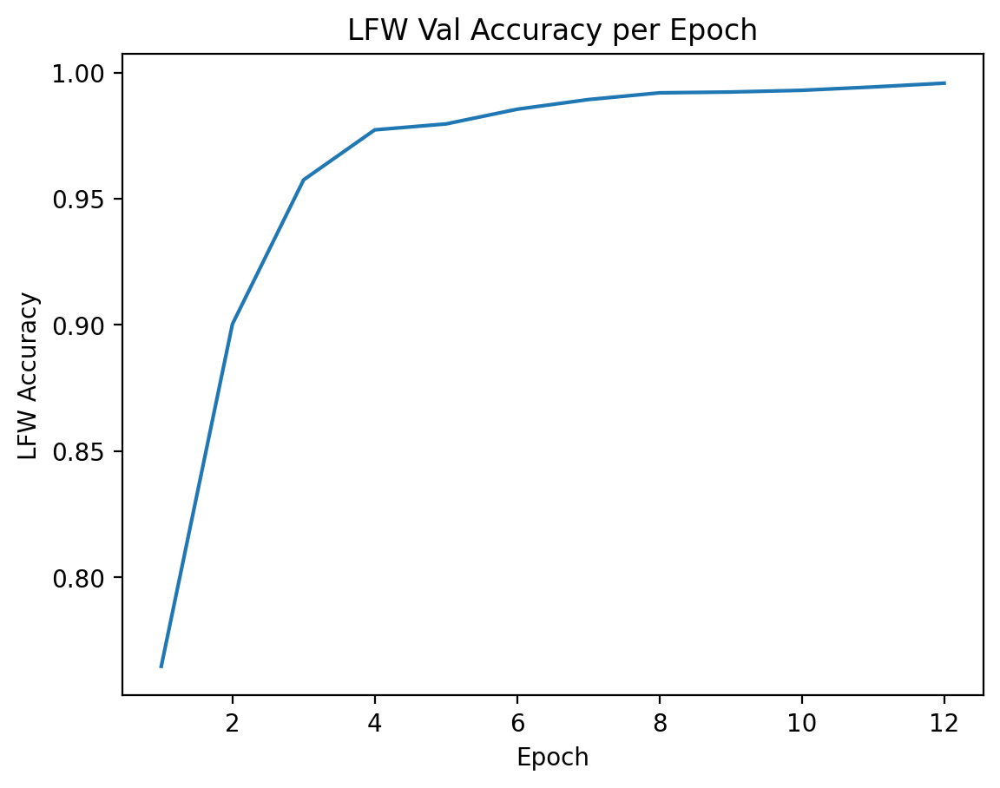
    

6. 在模型优化与部署准备部分，我学习了模型量化、剪枝和蒸馏等优化技术，并用PyTorch提供的工具实现了动态量化与 ONNX 导出。我先将训练好的模型切换到推理模式，再对部分层进行动态量化，以减小模型体积并提升 CPU 端推理效率。之后，我将模型导出为 ONNX 格式，并使用 ONNX Runtime 进行推理测试。然后我进行了对比，原PyTorch模型的输出和量化后的ONNX模型的输出的最大绝对误差是0.00000176，平均绝对误差是0.00000045，误差比较小，说明模型成功量化并转换为ONNX格式，且能进行ONNX推理。我也意识到一个模型不仅需要具备较好的训练效果，也需要考虑对其优化和部署的效果。

7. 在人脸特效算法实现部分，我首先学习了 GAN 的基本原理，并了解了 StarGAN 和 AttGAN 等多属性编辑的模型。同时我也用 StarGAN 模型在 CelebA 数据机上进行了训练，主要选择了六个属性进行编辑，分别是黑发，金发，棕发，性别，年龄和笑容。训练结束后，我也进行了测试，部分测试结果如下。
    

    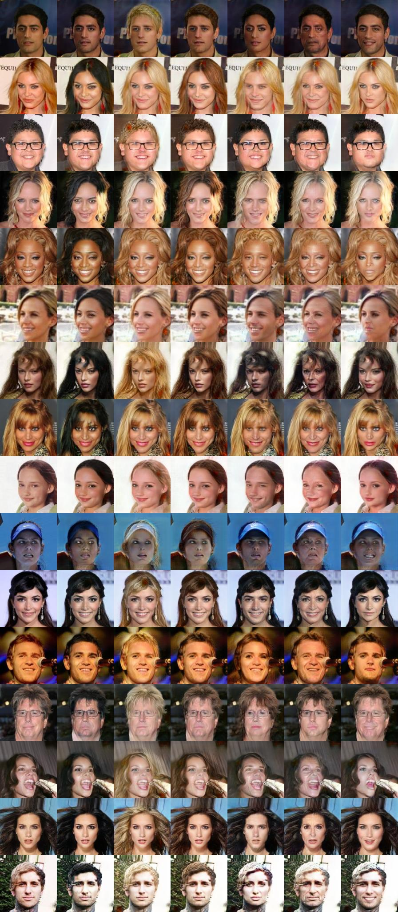
    

    
8. 在 3D 人脸重建任务中，我学习了 3DMM、NeRF 等三维重建相关基础概念，并尝试使用 PRNet 或 3DDFA_V2 从单张图像恢复 3D 人脸结构。之后，我利用 PyTorch3D 对重建结果进行渲染和可视化，并借助多角度观察分析模型效果。从结果来看，正面和小角度侧脸的重建效果相对较好，而在大角度侧脸或不可见区域，容易出现纹理拉伸和细节失真。这也让我认识到单张图像三维重建在不可见区域恢复方面仍然存在一定局限。

9. 在动态特效实现部分，我完成了基于实时人脸关键点检测的动态贴纸和基础美颜美妆功能。具体而言，我实现了实时关键点跟踪，并将贴纸叠加到检测到的人脸区域上。同时，我还实现了磨皮、美白和口红三类基础特效。其中，磨皮和美白主要通过构造人脸区域 mask，再将处理后的图像与原图进行局部融合来完成；口红效果则基于嘴唇关键点区域生成 lip mask，并在对应区域叠加颜色。通过这一阶段，我将前面学习到的检测、关键点与图像处理能力综合应用到了实时视频场景中。

## 收获与总结

通过本项目，我较系统地完成了从人脸检测、人脸关键点定位、人脸对齐、人脸识别，到模型优化、人脸属性编辑、3D 人脸重建和动态特效实现的完整学习与实践过程。

从知识层面来看，我加深了对卷积神经网络、ArcFace、GAN、3DMM 以及神经渲染相关概念的理解；从工程层面来看，我提升了使用 PyTorch、OpenCV、ONNX、PyTorch3D 等工具的能力；从实践层面来看，我也积累了处理环境依赖、阅读配置文件、分析模型结果和实现实时视觉效果的经验。

总体而言，本项目让我对智能视觉中“人脸识别 + 人脸特效”这一方向形成了较完整的认识，也进一步提高了我将理论知识转化为实际系统功能的能力。