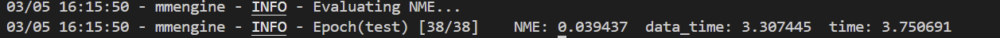

# Week 4 进度报告

1. 本周我完成了任务四，学习了HRNet和SAN的人脸关键点检测算法的基本原理，HRNet的特点是在训练过程中同时保留高分辨率分支和低分辨率分支，并让其不断进行信息交换，SAN强调的是通过风格聚合来提升模型在照片不同情况下的预测准确率。

2. 我选择下载300W数据集，并用MMPose里自带的HRNet配置文件（td-hm_hrnetv2-w18_8xb64-60e_300w-256x256.py）进行了人脸关键点检测训练。他训练阶段默认的batch size是64，但是这样我电脑跑不动，我就改成了32，同时默认的初始权重是HRNet backbone的预训练权重，这让我前期的训练更稳定和准确。第一轮训练结束后在验证集上的NME是0.052，在后面训练过程中慢慢下降，最后稳定在0.037左右。

3. 训练完成后，我用得到的权重文件在测试集上进行测试，得到的评估指标NME为0.039437。

同时我导出了测试阶段的结果图像，并选择了室内室外各五张图片上传到GitHub：[300W test images results](../assets/outputs/300w_keypoint_test),我认为这个关键点检测结果准确率还挺高的。

4. 然后我也在测试集图片上进行了人脸对齐，我稍微修改了MMpose里的visualization_hook.py，让它在验证测试集时，不仅能输出结果图像，还能生成每张照片68个关键点位置的.json文件，从而得到五个参考点（左眼中心，右眼中心，鼻尖，嘴角的两边），然后用仿射变换映射到一个统一位置，具体的代码在 [face_align.py](../docs/face_align.py)，以及对齐后的图像展示在 [face_aligned](../assets/outputs/300w_keypoint_test/face_aligned)，我同样只选取了十张图像上传。