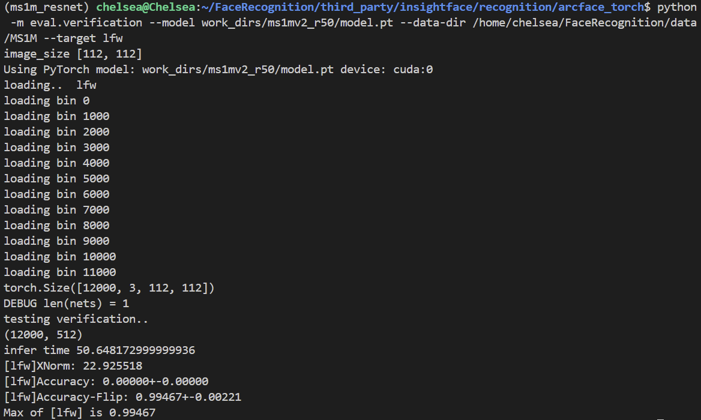
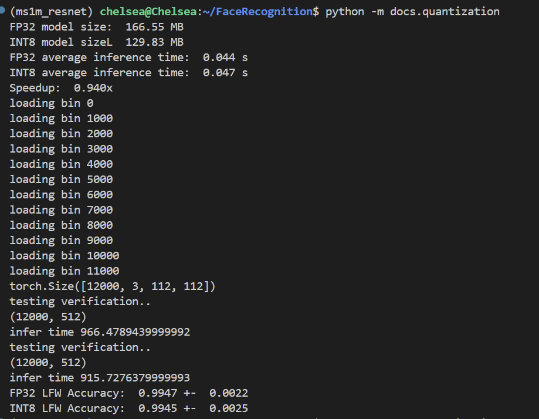

# Week 5 进度报告

本周我完成了任务五和大部分任务六

1. 首先我用了 InsightFace 里 Recognition/atcface_torch 的代码框架，主干网络是基于ResNet-50的 [ms1mv2_r50.py](../configs/ms1mv2_r50.py)，我只修改了数据集路径和数据集数量。同时我在 https://github.com/deepinsight/insightface/tree/master/recognition/_datasets_ 下载 MS1M-ArcFace 数据集, 他里面有5.8M张照片，我在原文件里添加了几行代码所以训练时能随机挑选其中50万张来训练，抽取子集的代码在 [dataset.py](../docs/ms1mv2_r50/dataset.py)。训练代码在 [train_v2.py](../docs/ms1mv2_r50/train_v2.py)，我基本没有修改。评估文件在 [verification.py](../docs/ms1mv2_r50/verification.py)，我改了几个地方确保读进来的图片是PyTorch tensor格式，并且能成功加载训练出来的model.pt，所以验证的时候不会因为格式不一致报错。

2. 训练结束后我得到一个traning.log里面有详细的训练过程中每十个global steps的loss, 以及每2000个global steps就验证一次，然后我用这些数据得到了训练过程中的准确率和损失曲线，生成图片的代码在 [train_acc_curve.py](../docs/train_acc_curve.py):

3. 然后我在 LFW 上测试训练出来的 R50（ResNet50）+ ArcFace 人脸识别模型。最后跑出来的结果是 Accuracy-Flip = 0.99467 ± 0.00221，达到了要求的目标，说明它学到的人脸特征还是很准确的。

4. 同时我学习了模型量化，剪枝和蒸馏的优化技术。模型量化是指把模型原本用的高精度数字换成低精度数字来表示，比如把FP32变成INT8，这样能减少模型大小，降低内存并提升运行效率。剪枝是指把模型里一些不太重要的参数或者结构删除，这样能减少不必要的计算，减少模型复杂度提升运行效率。蒸馏是指让一个小模型去学习一个更大模型已经学到的知识，比如大模型的输出分布和特征表示，这样可以在降低模型规模的同时，尽量保留他的的性能。

5. 我用PyTorch的量化工具对前面训练好的人脸识别模型进行动态量化，量化后的模型在[quantified_model](../assets/outputs/best_model_dynamic_quant.pt)，并且从精度，速度，模型大小三个方面进行比较，具体的代码在 [quantization.py](../docs/quantization.py)，比较结果如下：

可以看出原始的FP32模型大小为166.55MB，动态量化后的INT8模型大小为129.85MB，模型大小明显减少了。同时，我用一个随机tensor在CPU上分别用原始模型和量化模型向前传播了100次并计算平均单次推理时间，可以看出两个模型没有太大差别，原始模型（0.044s）不知道为什么还比量化模型（0.047s）快一点点。我还使用原始模型和量化模型在LFW数据集上进行了验证，原始模型的准确率为0.09947+-0.0022，量化模型的准确率为0.9945+-0.0025，差距也很小，说明动态量化没有怎么破坏模型的人脸识别能力。不过LFW验证的总推理时间来看，量化模型比原始模型快了很多，前者用了915.73秒后者用了966.48秒。