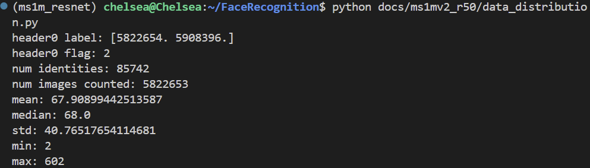
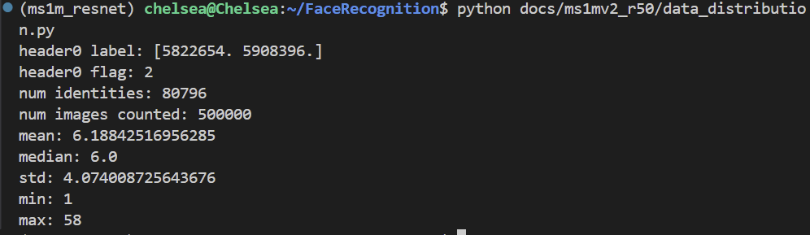
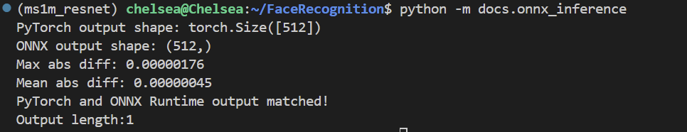

# Week 6 进度报告

本周我完成了任务六和任务七

1. 我先对上周的MS1M数据集和训练时的50万张子集做了分布分析，判断分布是否均匀。

完整的数据集分析如下：

50万张子集的分析如下：

整体来看，子集保留了大部分identity，而且每个identity图像数量的均值和中位数很接近，说明他虽然不是严格的均匀分布，但也没有严重的偏斜，整体保留了原数据集的分布特点。同时因为我是直接用不放回的随机抽样得到的子集，不会出现过度采样的问题，不过子集里还是会有一些identity只保留了一张或者很少几张图，这可能会对模型的泛化能力有一点影响，但整体来说这个子集还是比较合理的，适合用来训练。

2. 同时我把训练的模型转换为了ONNX格式，具体的代码在 [oxxn.py](../docs/onnx.py)，我首先把之前训练好的模型切换到了eval()模式，同时导出的对象只保留人脸识别中提取特征的backbone，然后将输入的尺寸固定为(1, 3, 112, 112)，和之前训练和验证阶段的输入尺寸保持一致。成功导出ONNX模型后，我用ONNX Runtime进行了推理测试，具体的代码在 [onnx_inference.py](../docs/onnx_inference.py)，推理结果如下图所示，PyTorch模型输出的尺寸为[512]，ONNX模型输出的尺寸为(512,)，保持一致。同时我比较了他们输出的数值差异，最大绝对误差是0.00000176，平均绝对误差是0.00000045，说明ONNX模型输出与原始PyTorch模型输出基本一致，误差特别小。可见模型成功转换为ONNX格式并能进行ONNX推理。

3. 然后我学习了GAN的原理以及StarGAN，AttGAN模型。GAN是指让生成器和判别器相互对抗来学习数据分布，经过反复博弈之后让生成器生成的结果更逼真。StarGAN是在GAN的基础上，把任务扩展到多域图像翻译，通过加入目标域标签，用一个模型完成多个属性或者多个域的编辑。StarGAN则更关注精细的人脸属性编辑，强调只修改目标属性，同时尽量保留原图中的其他信息和细节。

4. 我在 https://github.com/yunjey/stargan 下载了StyleGAN模型，并在CelebA数据集上进行训练，我选择了六个属性进行编辑，分别是黑发，金发，棕发，性别，年龄和笑容。这个训练的配置总结在 [config_attr_edit.md](./config_attr_edit.md)。训练结束后，我在测试集上进行了测试，并上传了五张训练结果图像在 [outputsImage](../assets/outputs/attrs_edit)，我认为测试的输出图像结果还算不错。

5. 然后我选择了四个属性，金发，性别，年龄和笑容，在测试集上分别进行编辑，得到对应的单张属性编辑后的图像，并对其与原图像进行了比较。改变金发属性的图像的FID: 24.65839926424721，Inception Score: 2.937446 ± 0.1068424。 改变性别属性的图像的FID:  18.228286859510547，Inception Score: 3.211716 ± 0.09631891。改变年龄属性的图像的FID:  17.04842722269143，Inception Score: 3.239423 ± 0.1096904，改变笑容属性的图像的FID:  13.939245935864733，Inception Score: 3.341577 ± 0.1467372。

FID低越说明生成图像和真实图像分布越接近，从结果来看，模型已经能够完成基本的人脸属性编辑任务，生成结果算好的。IS则是越高说明图片越清晰，整体样本越多样。但从我的结果来看，IS是偏低的，我认为有一部分是因为生成图片都是人脸，类别差异不是很大，所以会导致分数偏低。