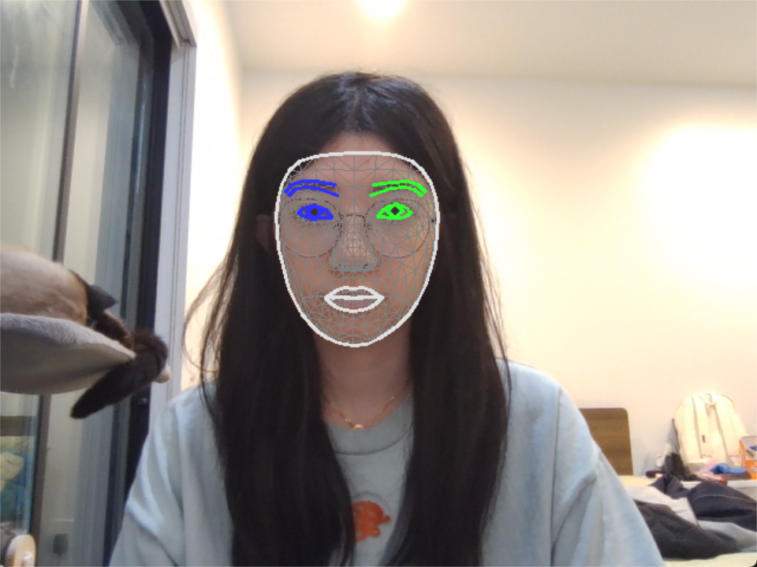

# Week 7 进度报告

本周我完成了任务八和部分任务九

1. 首先我学习理解了3D⼈脸重建的基本原理。3DMM用平均脸加身份变化和表情变化的方式来表示不同的人脸，而且因为他本身有比较强的人脸先验，单张图片的重建结果也会比较稳定。同时，NeRF是用神经网络学习三维空间里每个位置的颜色和密度，再通过体渲染生成图像。

2. 然后我选择用3DDFA_V2从单张图像进行3D人脸重建，我先从 https://github.com/cleardusk/3DDFA_V2/tree/master 下载 3DDFA_V2 的相关环境，我选择了四张图片进行3D人脸重建，图片在 [images](../assets/test_imgs/3d_reconstruct)，然后我运行了 3DDFA_V2 repo 里的 demo.py 导出 .obj 文件。导出的结果在 [3d_reconstruct_obj](../assets/outputs/3d_reconstruct_obj)，其中有一个图里有三个人脸，我只选择了其中一个上传。然后我用MeshLab可视化3D人脸重建的结果，我发现正面和小角度侧面的图片输出结果比较好，但对于看不见的地方，比如九十度的侧脸，重建的效果就比较差。

3. 然后我选择用PyTorch3D对重建的3D⼈脸进⾏渲染和可视化，具体的代码在 [render.py](../docs/3d_reconstruct/render.py)，一开始导出的结果一直没有人脸，只有纯背景，然后我对导入的mesh进行中心化和归一化，人脸就能正确地在图像中间生成了。生成的渲染图像在 [3d_reconstruct_render](../assets/outputs/3d_reconstruct_render)。

4. 然后我选择了一张图片进行多个角度可视化，包括正面视角，左转30度，左转60度，右转30度，右转60度，俯视角，下视角，具体的代码在 [visualization.py](../docs/3d_reconstruct/visualization.py)，同时我保留了原图作为对照，具体的结果在 [3d_reconstruct_multi_view](../assets/outputs/3d_reconstruct_multi_view)。

5. 最后我开始学习基于人脸关键点的动态特效，我学习了MediaPipe Face Landmark和OpenCV的一些文件，了解了怎么用OpenCV读取摄像头画面，并用MediaPipe对图像进行人脸关键点检测，然后把结果实时返回到摄像头画面里。具体的代码在 [real_time_landmarks.py](../docs/dynamic_effects/real_time_landmarks.py)，我截了一张图作为参考：

    后续做动态特效，贴纸和美妆时就可以直接基于这些关键点来确定五官然后实现具体的功能。