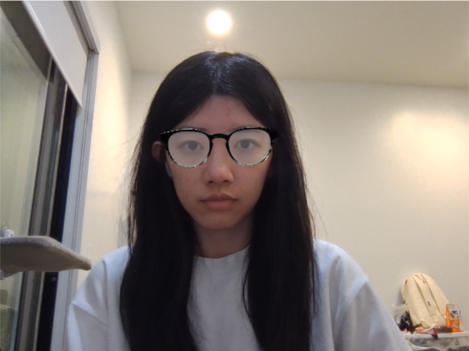
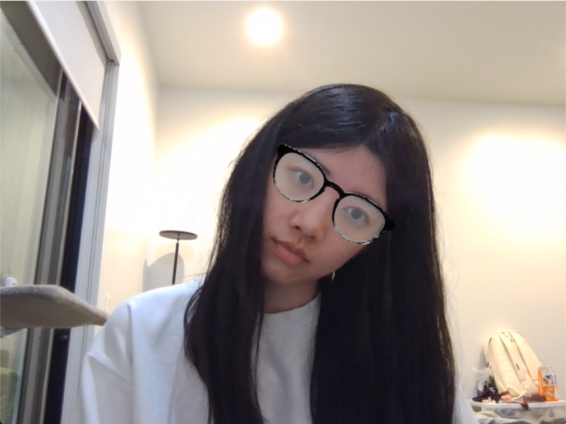
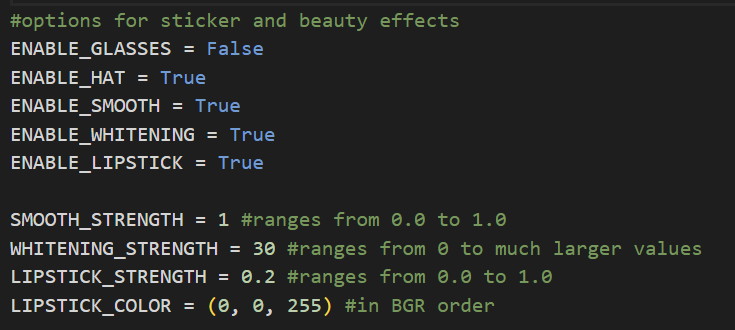

# Week 8 进度报告

本周我完成了任务九的动态特效实现

1. 我首先实现了眼镜贴纸效果。我先从官方图片里得到每个关键点具体的index: https://storage.googleapis.com/mediapipe-assets/documentation/mediapipe_face_landmark_fullsize.png，并选择左右眼外眼角的关键点来确定眼镜位置，根据这两个关键点的中点计算贴纸中心，确定贴纸大小和旋转角度。之后我通过 PNG 图片的 alpha 通道把眼镜叠加到原图上。然后我发现眼镜在歪头时边缘会被裁掉，后面通过重新计算旋转后的贴纸大小解决了。具体的代码在 [sticker.py](../docs/dynamic_effects/sticker.py)，具体的效果如下：
    
    

3. 然后我用同样的思路添加了帽子的贴纸，但是歪头时帽子会偏很多，然后我发现应该先计算脸的方向向量，再进一步求出向上的法向量，歪头时帽子应该沿着头顶向上的方向偏移而不是直接往上减 y。具体的代码也在 [sticker.py](../docs/dynamic_effects/sticker.py)，

4. 在美颜美妆特效部分，我实现了磨皮、美白和口红效果。我先根据脸或嘴唇部分的关键点生成对应的 mask，再用原图生成一张经过特效处理的图像（例如平滑后的图、提亮后的图和叠加颜色后的图）。然后利用 mask 得到融合权重 alpha，最后将特效图与原图进行加权融合，这样特效就能只作用在脸部和嘴唇区域，而背景保持原样。

5. 在系统集成阶段，我把眼镜、帽子、磨皮、美白和口红这些模块都整合到了一个主程序中 [main.py](../docs/dynamic_effects/main.py)，可以通过控制以下这些参数来决定开启哪个特效，以及每个美颜特效的强度：
    

6. 最后我对在 CPU 环境下的性能进行了测试，主要比较了不同特效开启时的平均帧率。结果显示，只开启单个贴纸类特效时，系统的实时性能基本保持稳定，其中眼镜贴纸为 28.14 FPS，帽子贴纸约为 28.21 FPS，而同时开启时帧率为 28.16 FPS。可以看出贴纸类特效的额外计算开销较小，对整体影响不明显。而单独开启磨皮时，平均帧率下降到 21.74 FPS，美白特效的帧率为 28.15 FPS，口红特效的帧率为28.18 FPS。在三个美颜效果开启的情况下，帧率下降到 13.46 FPS；当贴纸和美颜效果同时开启时，帧率为 13.01 FPS。这个结果说明系统中的性能主要集中在美颜部分尤其是磨皮，而贴纸的影响相对较小。具体的代码在 [performance_analysis.py](../docs/dynamic_effects/perfomance_analysis.py)。