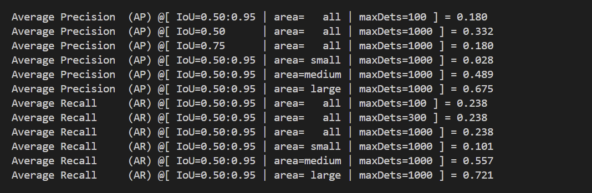

# WIDER FACE上训练的模型评估报告

我用MMDetection里的Retinanet框架在WIDER FACE数据集上训练了一个人脸检测模型并进行评估，主要结果为
**mAP = 0.180**
**AP50=0.332**，**AP75=0.180**
**AR（IoU=0.50:0.95, maxDets=100）= 0.238**
**AP_small=0.028、AP_medium=0.489、AP_large=0.675**
结果表明这个模型对中/大脸检测效果比较好，对小脸明显偏弱。

## 可以提升的地方
在刚开始训练过程中，多次出现显存不足（CUDA OOM），我把 img_scale 降到 (800, 400)，并设置 samples_per_gpu = 1才能跑得动。但是这也导致输入图片的分辨率变小，小脸更糊，像素更少，模型更难学习， AP small 就会提升得更慢。我们可以使用更大显存，把 img_scale 往上调来得到更好的检测结果。

